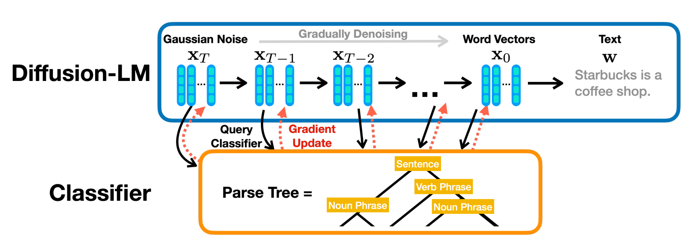

# Diffusion-Protein-Seq-Gen
Protein sequence generation with diffusion models

*Last Updated: 2023-09-23*

## Summary

This repository integrates state-of-the-art diffusion models to generation protein sequences.

**Highlights**

1. Diffusion for discrete data
2. Conditional diffusion with desired properties

## Diffusion Frameworks

### 1. Diffusion-LM

Integration Status: **Completed**

Code base complete. Final clean-up of individual files.

Framework integration in the folder `diffusionLM_prot`

**References:**

Li, X., Thickstun, J., Gulrajani, I., Liang, P. S., & Hashimoto, T. B. (2022). Diffusion-lm improves controllable text generation. Advances in Neural Information Processing Systems, 35, 4328-4343.

[Original Paper](https://proceedings.neurips.cc/paper_files/paper/2022/hash/1be5bc25d50895ee656b8c2d9eb89d6a-Abstract-Conference.html) | [Original Repository](https://github.com/XiangLi1999/Diffusion-LM)

Diffusion-LM. (Source of figure: Li et al., 2022)

